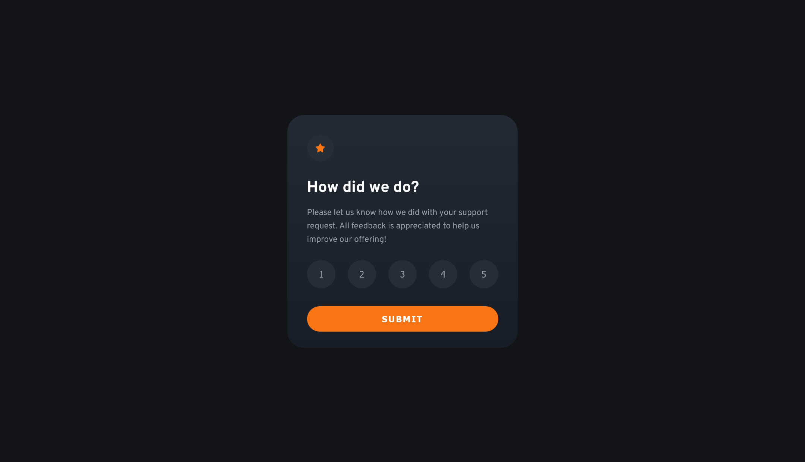

# Frontend Mentor - Interactive rating component solution

This is a solution to the
[Interactive rating component challenge on Frontend Mentor](https://www.frontendmentor.io/challenges/interactive-rating-component-koxpeBUmI).

## Table of contents

- [Overview](#overview)
  - [The challenge](#the-challenge)
  - [Screenshot](#screenshot)
  - [Links](#links)
- [My process](#my-process)
  - [Built with](#built-with)
  - [What I learned](#what-i-learned)
- [Author](#author)
- [Acknowledgments](#acknowledgments)

## Overview

### The challenge

Users should be able to:

- View the optimal layout for the app depending on their device's screen size
- See hover states for all interactive elements on the page
- Select and submit a number rating
- See the "Thank you" card state after submitting a rating

### Screenshot

### Links

- Solution URL:
  [Github](https://github.com/LuisVera1/FrontendMentor-Interactive-rating-component)
- Live Site URL: [Live site](https://your-live-site-url.com)

## My process

### Built with

- Semantic HTML5 markup
- CSS
- Flexbox
- Mobile-first workflow
- [React](https://reactjs.org/) - JS library

### What I learned

The change to showing thanks after giving a rating was interesting.

## Author

- Website - [Luisvera.dev](https://www.luisvera.dev)
- Frontend Mentor -
  [@LuisVera1](https://www.frontendmentor.io/profile/LuisVera1)

## Acknowledgments

Thanks to Frontend Mentor! 👍🏻
